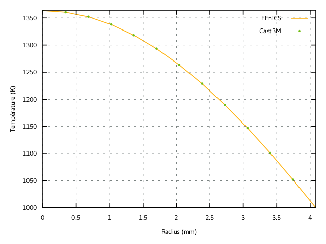

% Stationnary non-linear heat transfer: 3D problem and performance comparisons
% Jérémy Bleyer, Thomas Helfer
% 17/04/2020

# Description of the non-linear constitutive heat transfer law

This example is a direct continuation of the [previous 2D example on
non-linear heat transfer](mgis_fenics_nonlinear_heat_transfer.html). The
present computations will use the same behaviour
`StationaryHeatTransfer.mfront`.

{width=50%}

# FEniCS implementation

We now consider a portion of nuclear fuel rod (Uranium Dioxide
$\text{UO}_2$) subject to an external imposed temperature
$T_{ext}=1000\text{ K}$ and uniform volumetric heat source $r=300 \text{
MW/m}^3$. From the steady state heat balance equation
$\operatorname{div}\mathbf{j} = r$, the variational formulation is now:

\begin{equation}
F(\widehat{T}) = \int_\Omega \mathbf{j}(T,\nabla T)\cdot\nabla \widehat{T}\,\text{dx} + \int_\Omega r \widehat{T} \,\text{dx}=0 \quad \forall \widehat{T}
\end{equation}

which fits the general default format of a `MFrontNonlinearProblem`:
\begin{equation}
F(\widehat{u}) = \sum_i \int_\Omega \boldsymbol{\sigma}_i(u)\cdot \mathbf{g}_i(\widehat{u})\,\text{dx} -L(\widehat{u}) =0 \quad \forall \widehat{u}
\end{equation}

where $(\boldsymbol{\sigma}_i,\mathbf{g}_i)$ are pairs of dual
flux/gradient and here the external loading form $L$ is given by
$-\int_\Omega r \widehat{T} \,\text{dx}$. Compared to the previous
example, we just add this source term using the `set_loading` method.
Here we use a quadratic interpolation for the temperature field and
external temperature is imposed on the surface numbered 12. Finally, we
also rely on automatic registration of the gradient and external state
variables as explained in the previous demo.


```python
from dolfin import *
import mgis.fenics as mf
from time import time

mesh = Mesh()
with XDMFFile("fuel_rod_mesh.xdmf") as infile:
    infile.read(mesh)
mvc = MeshValueCollection("size_t", mesh, 2)
with XDMFFile("fuel_rod_mf.xdmf") as infile:
    infile.read(mvc, "facets")
facets = cpp.mesh.MeshFunctionSizet(mesh, mvc)

V = FunctionSpace(mesh, "CG", 2)
T = Function(V, name="Temperature")
T_ = TestFunction(V)
dT = TrialFunction(V)
T0 = Constant(300.)
T.interpolate(T0)

Text = Constant(1e3)
bc = DirichletBC(V, Text, facets, 12)

r = Constant(3e8)

quad_deg = 2
material = mf.MFrontNonlinearMaterial("../materials/src/libBehaviour.so",
                                      "StationaryHeatTransfer")
problem = mf.MFrontNonlinearProblem(T, material, quadrature_degree=quad_deg, bcs=bc)
problem.set_loading(-r*T*dx)
```

The `solve` method computing time is monitored:


```python
tic = time()
problem.solve(T.vector())
print("MFront/FEniCS solve time:", time()-tic)
    MFront/FEniCS solve time: 51.4562623500824
```

The temperature field along a radial direction along the top surface has
been compared with computations using [Cast3M finite-element
solver](http://www-cast3m.cea.fr/). Both solutions agree perfectly:

{width=75%}

# Performance comparison

For the purpose of performance comparison, we also implement a direct
non-linear variational problem with pure UFL expressions. This is
possible in the present case since the non-linear heat constitutive law
is very simple. Note that we enfore the use of the same quadrature rule
degree. The temperature field is also reinterpolated to its previous
initial value for a fair comparison between both solution strategies.


```python
A = Constant(material.get_parameter("A"))
B = Constant(material.get_parameter("B"))
j = -1/(A + B*T)*grad(T)
F = (dot(grad(T_), j) + r*T_)*dx(metadata={'quadrature_degree': quad_deg})
J = derivative(F, T, dT)

T.interpolate(T0)
tic = time()
solve(F == 0, T, bc, J=J)
print("Pure FEniCS solve time:", time()-tic)
    Pure FEniCS solve time: 47.62119770050049
```

We can observe that both methods, relying on the same default Newton
solver, yield the same total iteration counts and residual values. As
regards computing time, the pure FEniCS implementation is slightly
faster as expected. In the following table, comparison has been made for
a coarse (approx 4 200 cells) and a refined (approx 34 000 cells) mesh
with quadrature degrees equal either to 2 or 5.

|Mesh type | Quadrature degree | FEniCS/MFront | Pure FEniCS |
|:--------:|:-----------------:|:-------------:|:-----------:|
| coarse   | 2                 |     1.2 s     | 0.8 s       |
| coarse   | 5                 |     2.2 s     | 1.0 s       |
| fine     | 2                 |     62.8 s    | 58.4 s      |
| fine     | 5                 |     77.0 s    | 66.3 s      | 

The difference is slightly larger for large quadrature degrees, however,
the difference is moderate when compared to the total computing time for
large scale problems.

# On the use of the correct tangent operator

Most FE software do not take into account the contribution of
$\dfrac{\partial \mathbf{j}}{\partial T}$ to the tangent operator. One
can easily test this variant by assigning `dj_ddT` in the MFront
behaviour or change the expression of the jacobian in the pure FEniCS
implementation by:

```
J = dot(grad(T_), -grad(dT)/(A+B*T))*dx(metadata={'quadrature_degree': quad_deg})
```

In the present case, using this partial tangent operator yields a
convergence in 4 iterations instead of 3, giving a computational cost
increase by roughly 25%.
